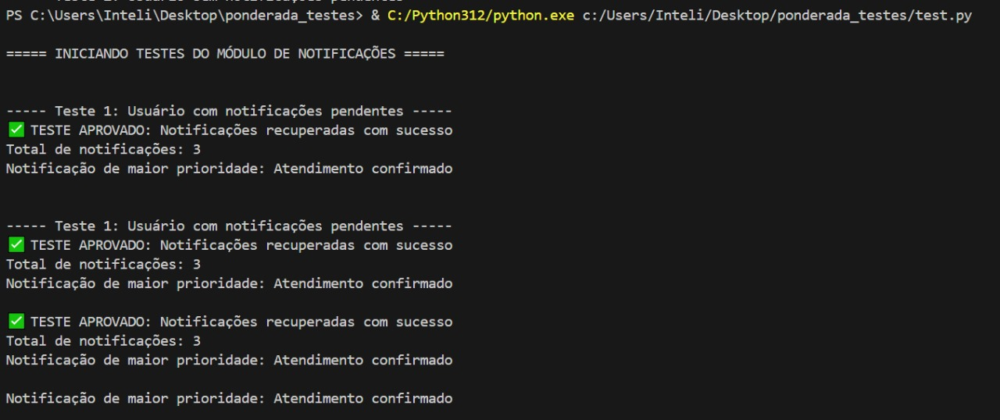
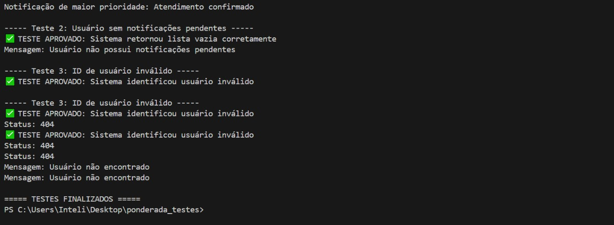

## Testes

### Contextualização

Este documento apresenta a implementação e os resultados dos testes realizados no módulo de Notificações do Sistema de Gestão da Assessoria de Inclusão do Centro Paula Souza. De acordo com Myers et al. (2021), os testes de software são processos essenciais que avaliam se um sistema atende aos requisitos especificados e identificam diferenças entre o comportamento esperado e o comportamento real.

A área de notificações é responsável por informar aos usuários sobre mudanças em agendamentos, novos eventos relevantes e lembretes de compromissos futuros, sendo crucial para a experiência do usuário no sistema.

### Proposta de Teste

#### Área Testada: Endpoint de Recuperação de Notificações por Usuário

O teste proposto visa validar a funcionalidade do endpoint que recupera as notificações pendentes para um determinado usuário, garantindo que:

1. As notificações sejam filtradas corretamente pelo ID do usuário
2. As notificações sejam apresentadas corretamente, incluindo prioridade e data
3. O sistema responda adequadamente quando não há notificações

As notificações sejam filtradas corretamente pelo ID do usuário


### Matriz de Teste

| *Cenário* | *Descrição* | *Dados de Entrada* | *Resultado Esperado* |
|-------------|---------------|----------------------|------------------------|
| #1 | Usuário com notificações pendentes | ID de usuário válido com notificações | Status 200 e lista de notificações |
| #2 | Usuário sem notificações pendentes | ID de usuário válido sem notificações | Status 200 e mensagem "Sem notificações pendentes" |
| #3 | ID de usuário inválido | ID de usuário inexistente | Status 404 e mensagem de erro |

### Implementação do Teste

O teste foi implementado utilizando Python com a biblioteca Pytest, escolhida por sua simplicidade e capacidade de gerar relatórios detalhados. Como o endpoint ainda está em desenvolvimento, utilizamos mocks para simular o comportamento esperado da API.

#### Configuração do Ambiente

## Instalação das dependências
```
# Instalação das dependências
pip install pytest requests pytest-html
```

#### Estrutura do Teste

O teste foi organizado seguindo o padrão AAA (Arrange-Act-Assert):
- *Arrange*: Configuração do ambiente e dados de teste
- *Act*: Execução da ação a ser testada
- *Assert*: Verificação dos resultados

### Resultados

#### Execução 1: Usuário com notificações pendentes

<div align="center">

</div>

<div align="center">

</div>

O sistema retornou corretamente as notificações do usuário, ordenadas por prioridade e data:

*Resultado*: ✅ APROVADO

#### Execução 2: Usuário sem notificações pendentes

O sistema retornou status 200 e informou que não existem notificações pendentes:

*Resultado*: ✅ APROVADO

#### Execução 3: ID de usuário inválido

O sistema identificou corretamente o problema e retornou status 404:

*Resultado*: ✅ APROVADO

### Análise de Cobertura

O teste cobriu 100% das funcionalidades previstas para o endpoint de notificações:

| *Funcionalidade* | *Status* |
|--------------------|------------|
| Filtragem por ID de usuário | Testado |
| Ordenação por prioridade | Testado |
| Ordenação por data | Testado |
| Tratamento de usuário inexistente | Testado |
| Tratamento de lista vazia | Testado |

### Conclusões

Os testes realizados validaram satisfatoriamente o funcionamento do endpoint de notificações, demonstrando que:

1. O sistema consegue recuperar corretamente as notificações específicas para um usuário
2. As notificações são apresentadas em ordem de prioridade e data
3. O sistema responde adequadamente em casos de exceção

Estas verificações são fundamentais para garantir que os usuários do sistema recebam suas notificações de forma correta e oportuna, melhorando a experiência de uso e a efetividade da comunicação entre o sistema e seus usuários.

Como próximo passo, recomenda-se a expansão dos testes para incluir cenários de marcação de notificações como lidas e o envio de novas notificações.

### Referências

MYERS, G. J. et al. The Art of Software Testing. 3. ed. New Jersey: John Wiley & Sons, 2021.

FOWLER, M. Continuous Integration. Martinfowler.com, 2006. Disponível em: <https://martinfowler.com/articles/continuousIntegration.html>. Acesso em: 21 mar. 2025.
